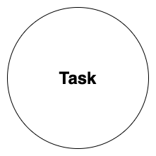
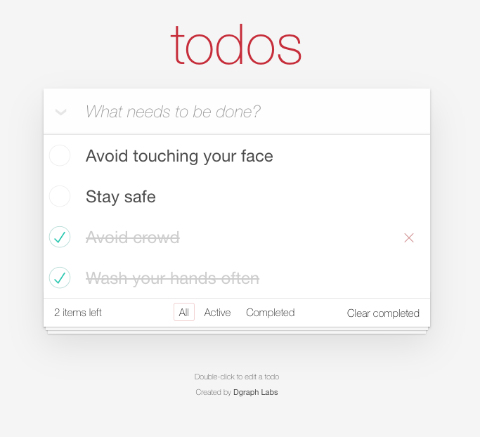
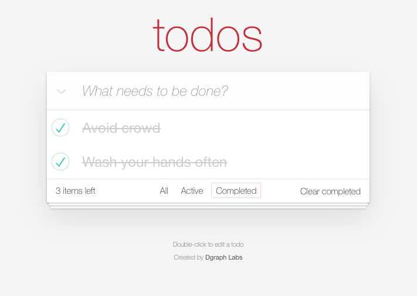

# Todo React App powered by Dgraph

Todo React App using GraphQL powered by Dgraph.

### GraphQL Schema Design for Dgraph

At first, when we visualize the main components of Todo App, we get node as shown below:



Equivalent GraphQL schema for the graph above would be as follow:

```graphql
type Task {
    ...
}
```

So what do you think we should have for a Todo node?

We have mainly a title and a status to check if the Todo was completed.
We represent that in the GraphQL schema shown below:

```graphql
type Task {
    id: ID!
    title: String!
    completed: Boolean!
}
```

_Note: You will be required to add custom directives to support additional functionalities of Dgraph._

### Set Up the Environment

Before we begin, make sure that you have [Docker](https://docs.docker.com/install/)
installed on your machine.

Let's begin by starting Dgraph standalone by running the command below:

```bash
docker run --rm -it -p 8080:8080 -v ~/dgraph:/dgraph dgraph/standalone:v20.03.1
```

Save the content below as `schema.graphql`.

```graphql
type Task {
  id: ID!
  title: String! @search(by: [fulltext])
  completed: Boolean! @search
}
```

Let's load up the GraphQL schema file to Dgraph:

```bash
curl -X POST localhost:8080/admin/schema --data-binary '@schema.graphql'
```

If you’ve followed the steps above correctly, there’s a GraphQL server up and running.
You can access that GraphQL endpoint with any of the great GraphQL developer tools.
Good choices include GraphQL Playground, Insomnia, GraphiQL and Altair.

Set up any of them and point it at `http://localhost:8080/graphql`. If you know lots about GraphQL, you might want to explore the schema, queries and mutations that were generated from the input.

### Mutating Data

Let's add two todos in our Todo App.

```graphql
mutation {
  addTask(input: [
    {
      title: "Avoid crowd",
      completed: true
    },
    {
      title: "Wash your hands often",
      completed: true
    },
    {
      title: "Avoid touching your face",
      completed: false
    },
    {
      title: "Stay safe",
      completed: false
    }
  ]) {
    task {
      id
      title
    }
  }
}
```

### Querying Data

Let's fetch the todos to list in our Todo App:

```graphql
query {
  queryTask {
    id
    title
    completed
  }
}
```

Running the query above should return JSON response as shown below:

```json
{
  "data": {
    "queryTask": [
      {
        "id": "0x2",
        "title": "Stay safe",
        "completed": false
      },
      {
        "id": "0x3",
        "title": "Avoid crowd",
        "completed": true
      },
      {
        "id": "0x4",
        "title": "Wash your hands often",
        "completed": true
      },
      {
        "id": "0x5",
        "title": "Avoid touching your face",
        "completed": false
      }
    ]
  }
}
```

### Querying Data with Filters

Before we get into querying data with filters, we will be required
to define search indexes to the specific fields.

Let's say we have to run a query on the _completed_ field, for which
we add `@search` directive to the field as shown in the schema below:

```graphql
type Task {
  id: ID!
  title: String!
  completed: Boolean! @search
}
```

The `@search` directive are added to support the native search indexes of **Dgraph**.

Now, let's fetch all todos which are completed :

```graphql
query {
  queryTask(filter: {
    complete: {
      eq: "true"
    }
  }) {
    id
    title
  }
}
```

Next, let's say we have to run a query on the _title_ field, for which
we add another `@search` directive to the field as shown in the schema below:

```graph
type Task {
    id: ID!
    title: String! @search(by: [fulltext])
    completed: Boolean! @search
}
```

The `fulltext` search index provides the advanced search capability to perform equality
comparision as well as matching with language specific stemming and stopwords.

Now, let's try to fetch todos whose title has the word _"remember"_ :

```graphql
query {
  queryTask(filter: {
    title: {
      alloftext: "remember"
    }
  }) {
    id
    title
    completed
  }
}
```

## Bring up ToDo App

### `npm install`

Install the dependencies needed to bring up the application.

### `npm start`

If you are not running Dgraph locally, then be sure to modify *graphqlUrl*
in `src/config.json`  to point at accurate GraphQL endpoint before starting
the application.

Runs the Todo application.<br />
Open [http://localhost:3000](http://localhost:3000) to view it in the browser.

### `npm build`

Compiles the Todo application and minifies to generate the production build.

## Screenshots





---

